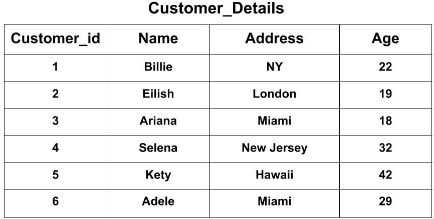

Prerequisites: Python, packages "requests" and "wikipedia" installed via pip, intructions to be added later

# SQLite via Python

SQL ("Structured Query Language") is a language for constructing and using databases that has been very popular for a long time. It was the third most-used programming language for all professional developers who responded to the Stack Overflow Developer Survey in 2022. The databases that you construct and use by writing SQL consists of tables with rows and columns in which you can store data persistently and retrieve later; the idea of a database is that it will store data behind the scenes that persists even if the program that uses data is closed and the computer its running on is turned on and off again; a database is usually basically a sophisticated way to save data to files.

A lot of SQL databases are maintained by database servers. These are applications, like MySQL and PostgreSQL, who store data as needed on behalf of a program or programs that someone like you has written. These are large, powerful programs that are built to process huge amounts of data very quickly, and often run on networked devices so that they can be used by user-facing programs on other computers or devices entirely.

When you just need a way to save a normal amount of data in a normal file, though, the easiest SQL solution is to create a database with SQLite, which is a library of code that can be run independently or as part of any other program to create database files, where you need them and when you need them. SQLite is the most widely-deployed database in the world; it is installed on every Android and Apple phone so that apps can use it to store data, and when you click "save" in many desktop apps, like the Balsamiq Wireframes program I'm using in HIC right now, what you're saving is actually just a SQLite database file with a custom file extension. It's everywhere once you know where to look. For example, functions for running SQLite code are built right into Python.

## Wikipedia

Let's say that tomorrow, civilization collapses. We need to rebuild the electrical grid, figure out how to grow food, and distract ourselves from the state of the world by reading about stoats and marmosets. It would be nice to have access to Wikipedia without the Internet, and storing Wikipedia articles in a SQLite database would be one of the most convenient and reliable ways to do that.

For this lesson, though, we probably don't want to download all of Wikipedia, which is like 20gb of data. Let's download the important pages. There's a website called Topviews that catalogues the most-viewed pages on Wikipedia; let's check out [their list for 2022](https://pageviews.wmcloud.org/topviews/?project=en.wikipedia.org&platform=all-access&date=last-year&excludes=).

So, not all of this seems maximally conducive to rebuilding civilization, but I don't actually know how to search for that, so whoops. This should do for now. We can get this same data in a machine-readable form by going to https://pageviews.wmcloud.org/topviews/yearly_datasets/en.wikipedia/2022.json .

JSON is a text-based format for storing and retrieving data. What we have here is an array of JSON objects, which just consist of a few or a bunch of labeled data items; here we can see an array of objects, each of which contains data items labeled with "article", "views", "mobile_percentage", and "rank". These labels should be pretty self-explanatory.

```json
[
  {
    "article": "Main Page",
    "views": 1853370729,
    "mobile_percentage": 56.89,
    "rank": 1
  },
  {
    "article": "Cleopatra",
    "views": 55882835,
    "mobile_percentage": 98.54,
    "rank": 2
  },
  {
    "article": "Jeffrey Dahmer",
    "views": 54850769,
    "mobile_percentage": 87.79,
    "rank": 3
  },
  {
    "article": "2022 Russian invasion of Ukraine",
    "views": 50314503,
    "mobile_percentage": 52.08,
    "rank": 4
  }
]
```

If anyone's curious, the article for the Egyptian ruler Cleopatra was very popular last year because Android phones recommend searching for her. The rest of these are probably pretty self-explanatory.


We can download this article in Python:

```python
import requests

response = requests.get("https://pageviews.wmcloud.org/topviews/yearly_datasets/en.wikipedia/2022.json")
data = response.json()
print(data)
```

This gives us the data in the form of a list of Python dicts. A list is what it sounds like; it's like an array, it stores an ordered sequence of things. A dict is a thing you can make in Python to store arbitrary labeled data items quickly and easily. You can access data from lists by index and from dicts by label, like this:

```python
print(data[0])
print(data[0]["article"])
```

Downloading Wikipedia articles in Python is pretty easy if you use [the Python library called "Wikipedia"](https://github.com/goldsmith/Wikipedia). We can download Cleopatra's article and add to the flood:

```python
from wikipedia import WikipediaPage

cleo_page = WikipediaPage("Cleopatra")
print(cleo_page.content)
```

That's a lot of information. When rebuilding civilization, maybe we can start with ancient Egypt and continue from there.

Now that we have some access to some data, we can save it somewhere. First, we have to create a SQL table.

```python
import sqlite3

db = sqlite3.connect('wikipedia.db')
cursor = db.cursor()

cursor.execute('''
CREATE TABLE IF NOT EXISTS pages (
    title TEXT PRIMARY KEY,
    content TEXT,
    view_count INTEGER
)''')
```

Here, we import Python's built-in SQLite code, then open a database file called "wikipedia.db" (which will, by default, be saved in the same directory your Python file is in.) We create a cursor for it, which is basically an object that executes databases commands. Then, we write a database command in SQL. Our SQL code is in a Python multi-line string; you can create strings in Python using line breaks in them if you enclose the string in triple quotation marks (single or double.) This is not necessary, but helpful for formatting. To create a SQL table, you use the SQL "CREATE TABLE" command, to which we are adding "IF NOT EXISTS" so this program can run more than once without problems. Our table will be named "pages". Then, we list the columns that our table will have.

A SQL database consists of tables, which are defined by rows and columns. A row in a SQL database, also called an entry, corresponds to a Thing that you are storing some data about. The classic example of a SQL table is one that stores data for a company's customers; in that example, each row in the table would correspond to an customer. Columns in SQL tables dictate what data items you store in each row; in each row corresponding to each customer, you would probably have an entry for their name, another for their address, et cetera; the full table would look something like this:



In our example, we should instead have a row for each Wikipedia page we're saving for the purpose of apocalypse readiness. I've put three simple columns in our "pages" table for data that we already have around: title, content and view_count. You also have to indicate the data type that each of your columns will need to store; SQLite has a very useful TEXT type in addition to a type for integers, which we can use for storing each page's view count. We are also marking our "title" column as the table's primary key. What this means is that the "title" column uniquely identifies each row; no two rows can have the same primary key. This is useful to prevent inserting duplicate data, as we'll see.

We can loop over the items from our "data" list and insert them into our database table. First, lets limit `data` so we don't sit here forever downloading a ton of Wikipedia articles while testing our code. We can do this with Python list slicing syntax:

```python
data = data[1:5]
```

This grabs items from `data` starting at the first index and going up to (but not including) the second index; `data` now stores the Wikipedia articles from our list with the indexes 1, 2, 3, and 4. We're skipping the page that was at 0 because it's just the front page of Wikipedia which can't be saved normally and changes all the time anyway. Then, we can loop over those items and save their content:

```python
for ranked_page in data:
    article_title = ranked_page["article"]
    view_count = ranked_page["views"]
    page = WikipediaPage(article_title)

    cursor.execute(
        'INSERT OR IGNORE INTO pages(title, content, view_count) VALUES (?, ?, ?)',
        (article_title, page.content, view_count)
    )
    print("inserted", article_title)

db.commit()
```

Here, we're getting data, and we're inserting it into our database with a SQL "INSERT" command. We are using "INSERT OR IGNORE" to specify that if we attempt to insert invalid data, it can just be ignored; this will prevent us from inserting the same article twice if we run this program again later, because inserting a new row with the same primary key as another one counts as invalid. After this, you use the keyword VALUES, and then, if we were writing normal SQL, we would write out the data that we wanted to insert. However, since we're writing a Python program, we're not going to write out our values, but provide variables that store them, and the easiest and safest way to do that is to put placeholders for the values in the SQL command (those are the question marks) and then supply the variables below, outside of the SQL string.

Then, we have to call db.commit(). This will save our changes. We should now have a file called "wikipedia.db" that stores the articles we looped over.

To test this, we can run a SELECT command, which retrieves data from the database:

```python
cleo = cursor.execute("SELECT content FROM pages WHERE title='Cleopatra'").fetchone()
print(cleo)
```

If the SQL works, we can select the content from the database and display it. When you retrieve any number of rows from a table, which we are doing here by using "SELECT" and then `fetchone`, Python returns a weird type of list called a tuple; in this case, this not-list will have exactly one entry, because we called `fetchone` on the result of our SQL query. You can retrieve the entry and then use slicing to limit its length like this:

```python
print(cleo[0][0:200])
```

This code should still work if you run the program again with all the other code gone or commented out. (This is the minimal example of code that will work; to prove the point, you can just comment out the whole for loop)

```python
import sqlite3

db = sqlite3.connect('wikipedia.db')
cursor = db.cursor()

cleo = cursor.execute("SELECT content FROM pages WHERE title='Cleopatra'").fetchone()
print(cleo[0][0:200])
```

We now have our data saved and can retrieve it at will later.

So, it's great that we can retrieve pages based on their titles. But, it would be better to be able to search page content for keywords instead of needing to know the exact title to use. One basic way you can do this in SQL is to ask it to search all the content in the table for a pattern that you specify:

```python
cleo = cursor.execute("SELECT content FROM pages WHERE content LIKE '%Egypt%'").fetchone()
print(cleo[0][0:200])
```

This is a pattern that uses wildcards, which are special characters that can stand in for any text; the above example searches for the text "Cleo" with any text in front of it and any text after it. This will work. However, searching text like this has at least one big disadvantage: it is slow. The program has to search through all the text you have saved to see if it can find "Cleo" anywhere in any of it. There is an alternative: to use a full-text search index. A full-text search index will go through your text in advance, split it into words, and create a look-up table that can instantly find the pages that have a given word.

There are a number of advantages to using a full-text search index. First of all, it is fast. Second of all, since it operates on whole words, you can easily search for words without getting back larger words that contain them. You can search for "ant" without getting back "antidisestablishmentarianism"; you can search for "meow" without getting back "homeowner". This can be a good or a bad thing; sometimes, you want exact words, and sometimes, you want to be search for the word "walk" and get back results that include words like "walked" or "walking". Most full-text search engines will give you results like this; they do it by using "stemming." Stemming means taking words like "walking" and finding their stem, which is the part of the word that stays the same in different forms of the word, which in this case is just "walk"; text entries with "walking" will be stored in the lookup table under the stem "walk" so searching for "walk" will retrieve them.

To convert our SQLite table into a full-text search table, we just have to change its definition.

```python
cursor.execute('''
CREATE VIRTUAL TABLE IF NOT EXISTS pages USING fts4 (
    title TEXT PRIMARY KEY,
    content TEXT,
    view_count INTEGER
)''')
```

We are creating a virtual table, which is just something that looks like a normal SQL table but hides a more complicated data retrieval mechanism behind it. And we are using fts4, which stands for full text search 4, which is the 4th version of SQLite's full text search index mechanism. We can now use a bunch of different searches to get content from the database.

We can search for any page that has a certain word:

```python
cleo = cursor.execute("SELECT content FROM pages WHERE content MATCH 'Egypt'").fetchone()
print(cleo[0][0:200])
```

We can search for any page that has certain words anywhere in it:

```python
cleo = cursor.execute("SELECT content FROM pages WHERE content MATCH 'Egypt Roman Caesar'").fetchone()
print(cleo[0][0:200])
```

We can search for pages that have either of certain words (completely captalized words will be interpreted as search operators):

```python
cleo = cursor.execute("SELECT content FROM pages WHERE content MATCH 'Egypt OR nuthatches'").fetchone()
print(cleo[0][0:200])
```

We can search for pages that have a specific string of words (we have to escape the quotes to fit them into the SQL command):

```python
cleo = cursor.execute("SELECT content FROM pages WHERE content MATCH '\"Queen of the Ptolemaic Kingdom \"'").fetchone()
print(cleo[0][0:200])
```

And we can search for pages that have words with a specific prefix:

```python
cleo = cursor.execute("SELECT content FROM pages WHERE content MATCH 'Cleo*'").fetchone()
print(cleo[0][0:200])
```
